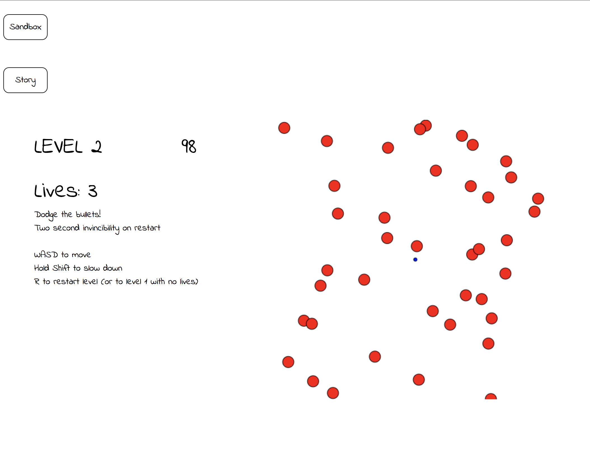

A small side project written in JavaScript. This is a game that involves dodging bullets, testing your overall scanning time, your reflexes, and your precision.

There are a total of 30 levels. You have 3 lives. At the beginning of each round, you will have 2 seconds of invincibility, so act quickly.

You will automatically advance to the next level after 10 seconds.

Or you can play around in sandbox mode if you want.

#### Controls:  
`W` `A` `S` `D` to move  
Hold `Shift` to slow down
`R` to restart (will restart the current level if you have lives, else will restart from level 1)

##### Setup
1. `git clone https://github.com/stevielum1/dodge_game.git`
2. `npm install`
3. Open `index.html` in your favorite browser
